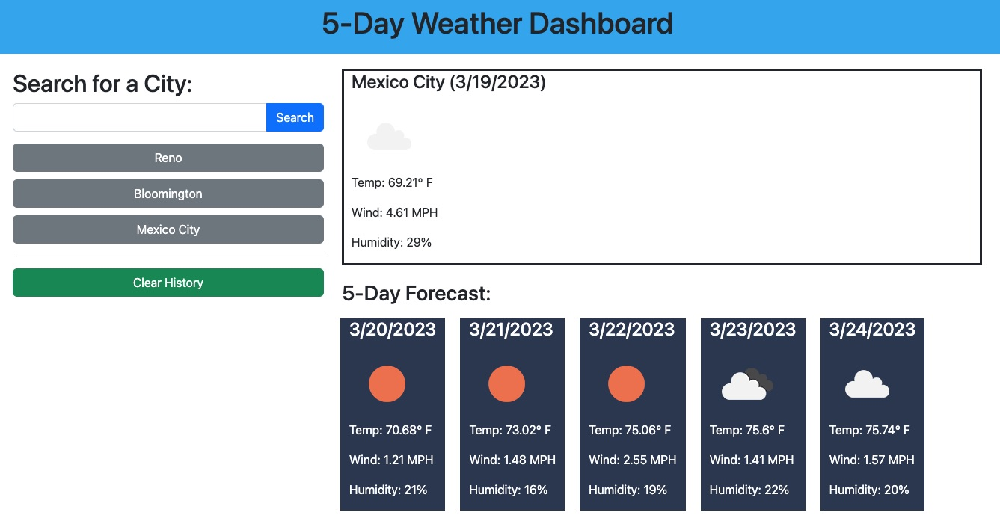

# 5-Day Weather Dashboard

## Description

This application was built to enable users to view the current weather conditions in a city of their choosing, along with a 5-day weather forecast. The user can view their search history and easily re-run searches from the history with just a click.

## Installation

N/A

## Usage

View the [deployed application](https://sendusyourbones.github.io/weather-dashboard/).

- To search for a new city, type the city name into the search bar and click "Search."
- If your search does not return any results, a "no matches" message will appear under the search bar. You can try your search again, making sure to enter a correctly spelled city name.
- Once you have searched for a city, it should appear as a button underneath the search bar. To search for that city again, click the button.
- To clear the search history, click "Clear History."

## Credits

- [Bootstrap](https://getbootstrap.com/) was used to help with layout
- Two resources used to help with calculating and displaying dates based on the searched city's timezone:
    - [FreeCodeCamp - How to Format Dates in JavaScript with One Line of Code](https://www.freecodecamp.org/news/how-to-format-dates-in-javascript/)
    - [Stack overflow - Convert Epoch time to human readable with specific timezone](https://stackoverflow.com/questions/44060804/convert-epoch-time-to-human-readable-with-specific-timezone)
- To troubleshoot a console error related to HTTP/HTTPS that I encountered after deployment, I referenced [Stack overflow - How to make XMLHttpRequest work over HTTPS on google chrome?](https://stackoverflow.com/questions/14607218/how-to-make-xmlhttprequest-work-over-https-on-google-chrome)

## License

MIT License